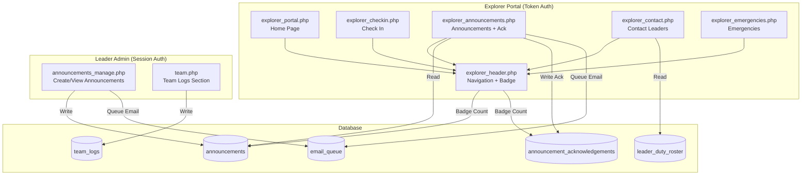
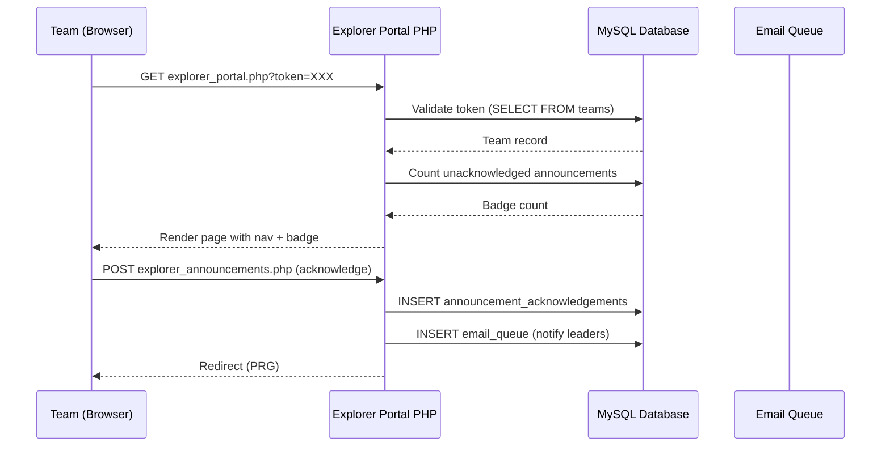
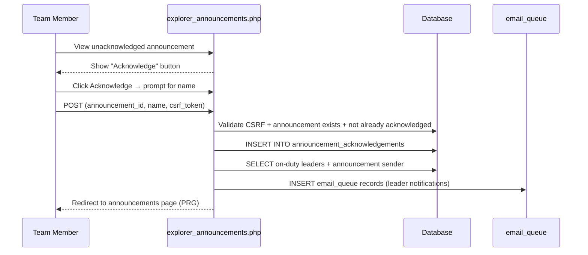
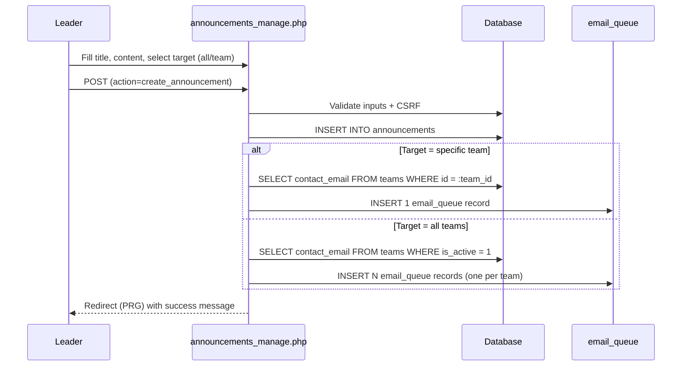
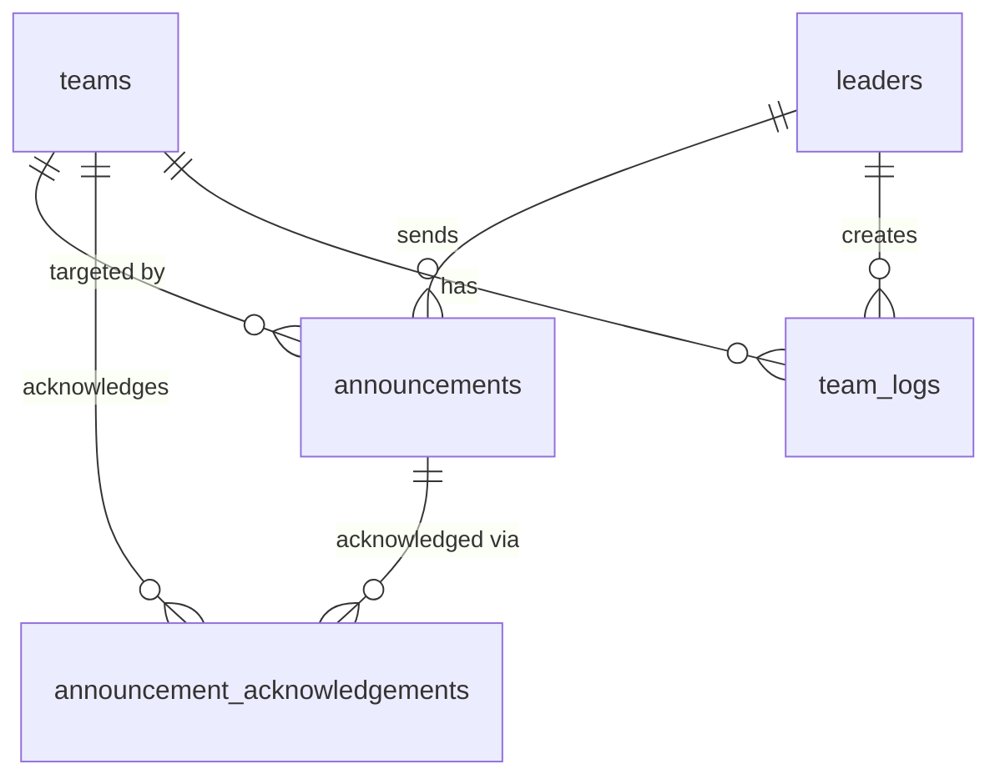

# Design Document: Explorer Portal Enhancement

## Overview

This design transforms the existing single-purpose Explorer Check-in Portal (`explorer_checkin.php`) into a multi-page team portal with navigation, announcements, contact information, team logging, and emergency references. The portal retains its token-based authentication model (via `explorer_token` on the `teams` table) and follows the existing PHP/MySQL application patterns: no framework, PDO database access, Bootstrap 4.6.2 UI, POST+PRG form handling, and CSRF protection via session tokens.

The enhancement introduces:
- A tab-based navigation header persistent across all explorer portal pages
- A home page as the default landing view
- The existing check-in functionality integrated as a tab
- A "Contact Leaders" page showing on-duty leaders with click-to-call phone links
- An announcements system with per-team acknowledgement workflow
- A leader-facing announcement creation interface
- Team-level log entries (distinct from person-level logs)
- An emergencies reference page
- Email notifications through the existing `email_queue` infrastructure

### Key Design Decisions

1. **Multi-file portal structure**: Each portal tab becomes a separate PHP file (prefixed `explorer_`) sharing a common header/footer partial. This matches the existing application pattern where each page is a standalone file.

2. **Shared portal layout partial**: A new `explorer_header.php` and `explorer_footer.php` handle the portal chrome (navigation, badge count, token propagation) so individual pages only contain their specific content.

3. **Announcements routing**: Announcements target either all teams or a single team. The `announcements` table uses a nullable `team_id` column—NULL means "all teams."

4. **Acknowledgement via name prompt**: The team acknowledges by providing a person's name (no authentication beyond the token). This is recorded for audit purposes.

5. **Immutable timestamps**: Both `team_logs` and `person_logs` use `created_at DATETIME NOT NULL DEFAULT CURRENT_TIMESTAMP` with no update mechanism exposed in the UI.

## Architecture



### Request Flow



## Components and Interfaces

### New PHP Files

| File | Purpose | Auth |
|------|---------|------|
| `explorer_header.php` | Portal navigation header partial with badge | Token (included) |
| `explorer_footer.php` | Portal footer partial (JS includes) | Token (included) |
| `explorer_portal.php` | Home page / landing | Token |
| `explorer_announcements.php` | View announcements + acknowledge | Token |
| `explorer_contact.php` | On-duty leaders with phone links | Token |
| `explorer_emergencies.php` | Emergency contact reference | Token |
| `announcements_manage.php` | Leader: create/view announcements | Session (leader) |

### Modified PHP Files

| File | Change |
|------|--------|
| `explorer_checkin.php` | Include `explorer_header.php`/`explorer_footer.php` instead of inline header; keep all existing logic |
| `team.php` (or equivalent team management page) | Add team logs section with form to create entries and display list |

### Shared Portal Authentication Function

Each explorer portal page will use a shared token validation pattern:

```php
// At top of each explorer_* page:
require_once __DIR__ . '/config.php';
if (session_status() !== PHP_SESSION_ACTIVE) session_start();

$pdo = db();
$token = trim($_GET['token'] ?? $_SESSION['explorer_portal_token'] ?? '');
$team = explorer_fetch_team($pdo, $token);

if (!$team) {
    http_response_code(404);
    // Render error page (no nav)
    exit;
}

// Store token in session for convenience
$_SESSION['explorer_portal_token'] = $token;
```

### Navigation Header (`explorer_header.php`)

Responsibilities:
- Render HTML `<head>` with Bootstrap 4.6.2 CSS, Leaflet CSS, app.css
- Render navigation tabs: Home, Check In, Announcements (with badge), Contact Leaders, Emergencies
- Each nav link includes `?token=` parameter
- Badge shows count of unacknowledged announcements for the current team
- Highlight active tab based on current script filename
- Mobile-responsive collapsible nav (Bootstrap navbar-toggler)

Badge count query:
```sql
SELECT COUNT(*) FROM announcements a
WHERE (a.team_id = :team_id OR a.team_id IS NULL)
  AND a.id NOT IN (
    SELECT announcement_id FROM announcement_acknowledgements WHERE team_id = :team_id
  )
```

### Announcements Acknowledgement Flow



### Announcement Creation Flow (Leader Side)



## Data Models

### New Table: `announcements`

```sql
CREATE TABLE announcements (
    id INT UNSIGNED AUTO_INCREMENT PRIMARY KEY,
    team_id INT UNSIGNED NULL COMMENT 'NULL = targets all teams',
    sender_leader_id INT UNSIGNED NOT NULL,
    title VARCHAR(255) NOT NULL,
    content TEXT NOT NULL,
    created_at DATETIME NOT NULL DEFAULT CURRENT_TIMESTAMP,
    INDEX idx_announcements_team (team_id),
    INDEX idx_announcements_created (created_at)
) ENGINE=InnoDB DEFAULT CHARSET=utf8mb4;
```

- `team_id = NULL` indicates the announcement targets all teams.
- `team_id = X` indicates it targets a specific team.
- `sender_leader_id` references `leaders.id`.

### New Table: `announcement_acknowledgements`

```sql
CREATE TABLE announcement_acknowledgements (
    id INT UNSIGNED AUTO_INCREMENT PRIMARY KEY,
    announcement_id INT UNSIGNED NOT NULL,
    team_id INT UNSIGNED NOT NULL,
    acknowledged_by_name VARCHAR(150) NOT NULL,
    acknowledged_at DATETIME NOT NULL DEFAULT CURRENT_TIMESTAMP,
    UNIQUE KEY uk_ack_announcement_team (announcement_id, team_id),
    INDEX idx_ack_team (team_id)
) ENGINE=InnoDB DEFAULT CHARSET=utf8mb4;
```

- One acknowledgement per team per announcement (enforced by unique key).
- `acknowledged_by_name` is a free-text name field (the team member who acknowledged).

### New Table: `team_logs`

```sql
CREATE TABLE team_logs (
    id INT UNSIGNED AUTO_INCREMENT PRIMARY KEY,
    team_id INT UNSIGNED NOT NULL,
    leader_id INT UNSIGNED NOT NULL,
    title VARCHAR(255) NOT NULL,
    body TEXT NULL,
    created_at DATETIME NOT NULL DEFAULT CURRENT_TIMESTAMP,
    INDEX idx_team_logs_team (team_id),
    INDEX idx_team_logs_created (created_at)
) ENGINE=InnoDB DEFAULT CHARSET=utf8mb4;
```

- `created_at` is auto-set and never updated (immutable timestamp).
- No `updated_at` column — no edit functionality exposed.

### Existing Table Usage

| Table | Usage in This Feature |
|-------|----------------------|
| `teams` | Token validation, `contact_email` for notifications, team name display |
| `leaders` | Sender identity for announcements, phone numbers for contact page |
| `leader_duty_roster` | Query on-duty leaders for contact page and acknowledgement notifications |
| `email_queue` | Queue announcement and acknowledgement notification emails |
| `person_logs` | Timestamp immutability enforcement (remove any editable `occurred_at` UI exposure) |

### Entity Relationship Additions



## Correctness Properties

*A property is a characteristic or behavior that should hold true across all valid executions of a system—essentially, a formal statement about what the system should do. Properties serve as the bridge between human-readable specifications and machine-verifiable correctness guarantees.*

### Property 1: Token validation gate

*For any* request to an explorer portal page, if the token does not match a valid team record, the system shall return an error page without rendering the navigation header or any portal content.

**Validates: Requirements 1.5**

### Property 2: Badge count accuracy

*For any* team with N announcements targeted to them (directly or via all-teams) and M acknowledgements recorded, the badge count displayed shall equal N - M.

**Validates: Requirements 1.3, 1.4**

### Property 3: Announcement visibility completeness

*For any* team viewing announcements, the displayed list shall include all announcements where `team_id IS NULL` OR `team_id = current_team_id`, and exclude all announcements targeting a different specific team.

**Validates: Requirements 5.1, 5.2**

### Property 4: Acknowledgement idempotence

*For any* announcement that has already been acknowledged by a team, submitting another acknowledgement for the same announcement and team shall have no effect (the acknowledgement record remains unchanged).

**Validates: Requirements 6.6**

### Property 5: Acknowledgement name validation

*For any* acknowledgement submission where the name field is empty or whitespace-only, the system shall reject the submission and leave the announcement in an unacknowledged state.

**Validates: Requirements 6.4**

### Property 6: Notification email targeting correctness

*For any* announcement created targeting a specific team, exactly one email queue record shall be created with that team's contact_email. For any announcement targeting all teams, one email queue record per active team (with non-empty contact_email) shall be created.

**Validates: Requirements 8.1, 8.2, 8.5**

### Property 7: Team log timestamp immutability

*For any* team_log entry, the `created_at` value at time of insertion shall equal the `created_at` value at any future point in time (no UPDATE statements modify it).

**Validates: Requirements 9.2, 10.3**

### Property 8: On-duty leader contact filtering

*For any* set of leaders in the duty roster, the Contact Leaders page shall display only those with `status = 'on_duty'` for the current date AND a non-empty phone number, excluding all others.

**Validates: Requirements 4.1, 4.2, 4.4**

## Error Handling

### Token Validation Errors

| Scenario | Behaviour |
|----------|-----------|
| Missing token parameter | Show error page: "No access token provided" |
| Invalid/expired token | Show error page: "This link is not valid" with HTTP 404 |
| Valid token, inactive team | Show error page: "This team portal is not currently active" |

All error pages render without the navigation header (per requirement 1.5).

### Form Submission Errors

| Scenario | Behaviour |
|----------|-----------|
| CSRF token mismatch | Show error: "Security check failed. Please refresh and try again." |
| Empty acknowledgement name | Show validation error inline, prevent form submission |
| Announcement already acknowledged | Silently ignore (idempotent), redirect to announcements |
| Empty announcement title/content (leader side) | Show validation error, retain form input |
| Team has no contact_email | Skip email queue insertion, do not block announcement creation |

### Database Errors

- All write operations use `try/catch` with transaction rollback where appropriate.
- Failed email queue insertions do not block the primary operation (announcement creation or acknowledgement recording).
- Table existence checks use `information_schema` queries (following the existing pattern in `schedule.php` and `leaders.php`) to gracefully handle missing tables during rollout.

### Email Queue Failures

- The existing `cron_send_email_queue.php` handles retries (up to 5 attempts) and stale processing state recovery.
- Invalid recipient emails are skipped at queue insertion time (`filter_var` check).

## Testing Strategy

### Unit Tests (Example-Based)

| Test Area | What to Verify |
|-----------|----------------|
| Token validation | Valid token returns team; invalid/empty returns null |
| Badge count query | Correct count with mix of acknowledged/unacknowledged announcements |
| Announcement targeting | NULL team_id visible to all teams; specific team_id visible only to that team |
| Acknowledgement recording | Name stored correctly; duplicate prevented by unique key |
| On-duty leader filtering | Only leaders with on_duty status and non-empty phone shown |
| Email queue insertion | Correct number of records for all-teams vs specific-team |
| Team log creation | Title required; body optional; created_at auto-set |
| CSRF validation | Valid token passes; mismatched token fails |

### Property-Based Tests

Property-based testing is applicable to the core logic functions (announcement visibility filtering, badge count calculation, email targeting). These can be tested as pure functions with generated inputs.

- **Library**: PHPUnit with `phpunit/phpunit` (no PHP PBT library in use; use data providers with randomized fixture generation)
- **Minimum iterations**: 100 per property test via data provider generation
- **Tag format**: `Feature: explorer-portal-enhancement, Property N: description`

Key property tests:
1. Badge count = total targeted announcements - acknowledged count (Property 2)
2. Announcement list includes all-team + team-specific, excludes other-team (Property 3)
3. Email queue record count matches team targeting logic (Property 6)
4. Empty/whitespace names always rejected (Property 5)

### Integration Tests

| Test Area | What to Verify |
|-----------|----------------|
| End-to-end announcement flow | Create → display on portal → acknowledge → email queued |
| Check-in within new portal | Existing check-in still works with new nav header |
| Navigation links | All tabs include correct token parameter |
| Mobile rendering | Responsive nav collapses correctly |

### Manual Testing

- Mobile device testing (primary use case is teams on smartphones in the field)
- Cross-browser testing (Bootstrap 4.6.2 compatibility)
- Email rendering in common clients (Gmail, Outlook, Apple Mail)
